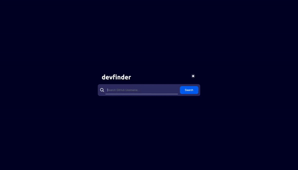

# devfinder

GitHub user API를 활용하여 제작한 개인 포트폴리오용 깃허브 유저 검색 웹사이트입니다.

## Table of contents

- [Overview](#overview)
  - [Features](#features)
  - [Screenshot](#screenshot)
  - [Links](#links)
- [My process](#my-process)
  - [Built with](#built-with)
  - [What I learned](#what-i-learned)
- [Author](#author)

## Overview

### Features

- GitHub user API 활용하여 유저 검색
- 다크모드/라이트모드 토글 기능
- 스크린 크기별 반응형 구현

### Screenshot

### Links

- Live Site URL: [https://thisisyeji.github.io/devfinder](https://thisisyeji.github.io/devfinder)

## My process

### Built with

- Firebase
- [React](https://reactjs.org/) - JS library
- [Styled Components](https://styled-components.com/) - For styles

### What I learned

- GitHub user API 활용

## Author

- Website - [https://github.com/thisisyeji](https://github.com/thisisyeji)
